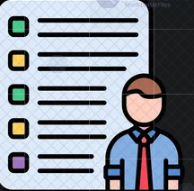

<h1></h1>

   
  
  
  

### 🛠️ GitHub Stats

<!-- -->

<!-- -->

<!-- -->

 
  
<h2>📘 My Open Source Projects</h2>

  

  
    
  
      
      

 
  
<h2>Projects I've Contributed To</h2>

  

<!-- Uncomment to add a project

-->
      

## 🔗 Explore All My Repositories

## 🔧 Programming Languages, Markup, Frameworks, DB, and Tools

## 📈 GitHub Activity

